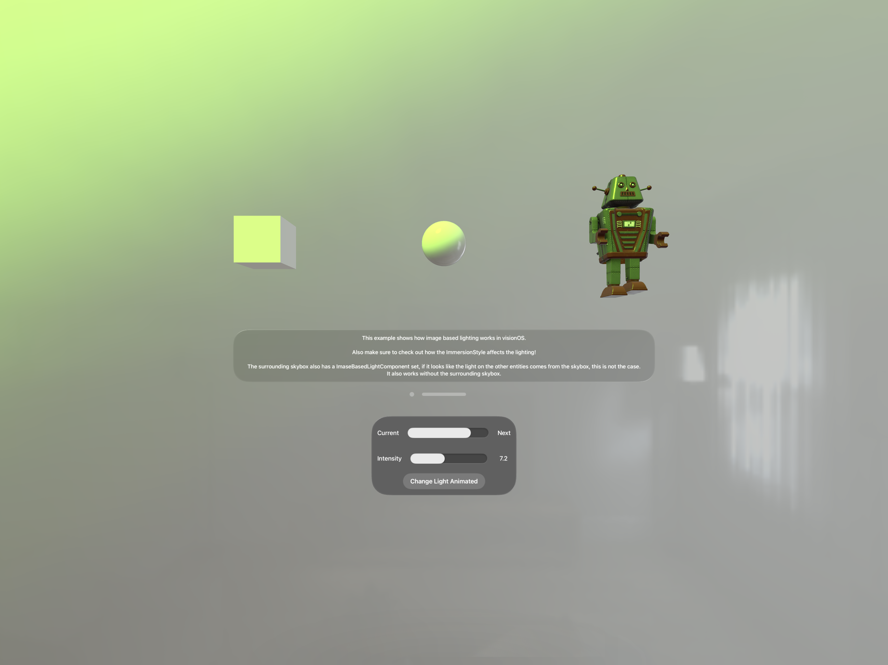

# Image Based Lighting Example in visionOS

In this example you can see how the image based lighting works in visionOS. Play around with the intensity, the blending, the animation of the blending and see how the immersion affetcs the lighting.

